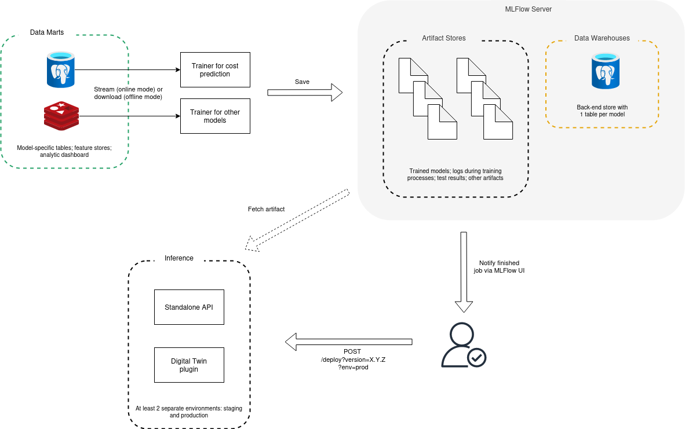

# Training a Cost Prediction Model

This module contains source code to train an AI model for the cost prediction service. This model is then used inside our digital twin. Below is the diagram of how AI models are trained, tested, and deployed.

